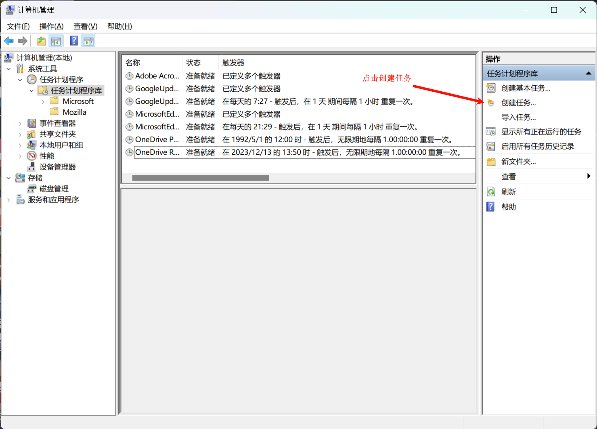
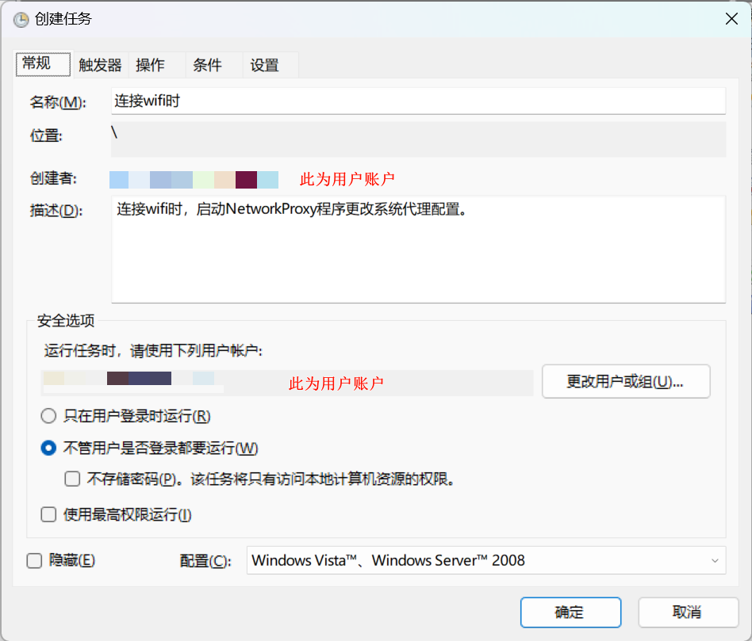
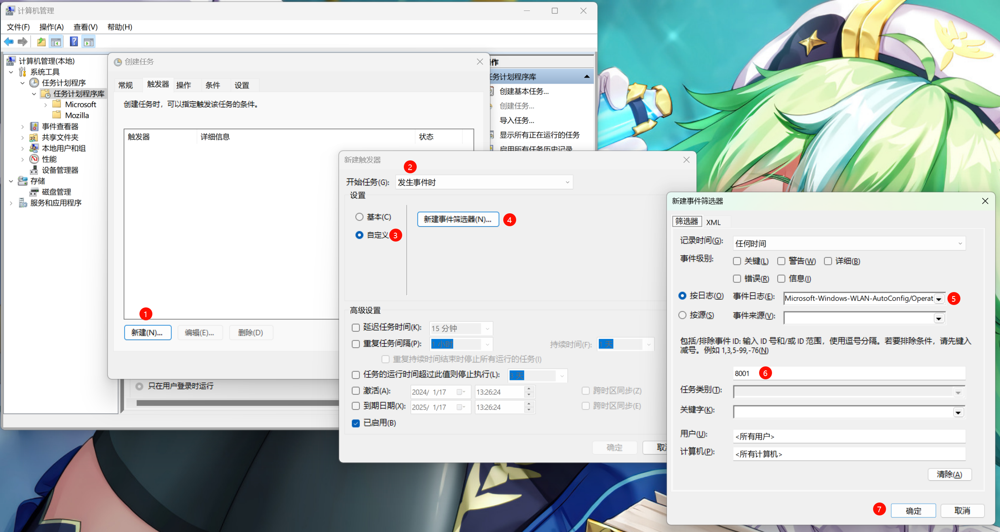
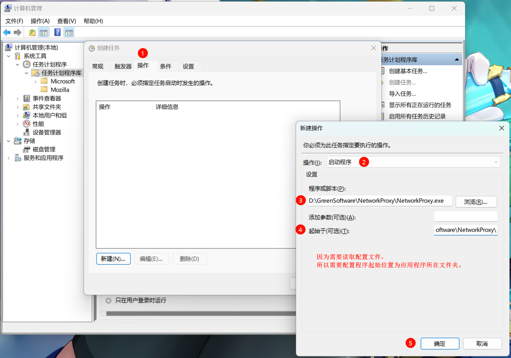
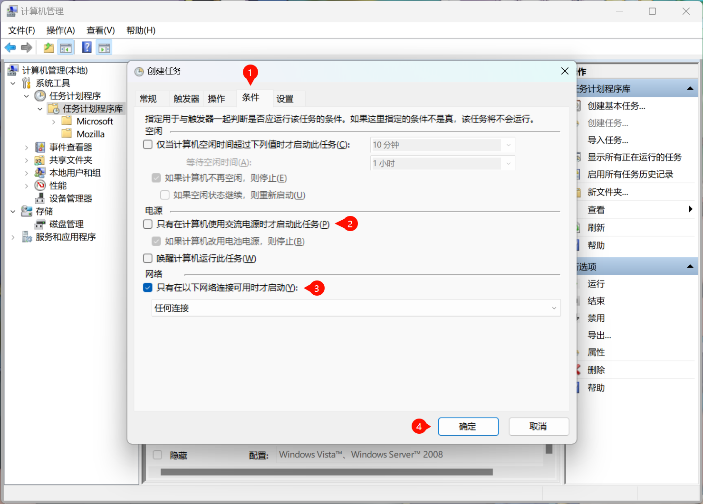
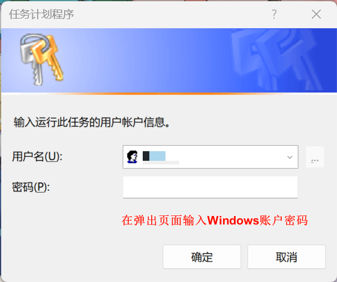
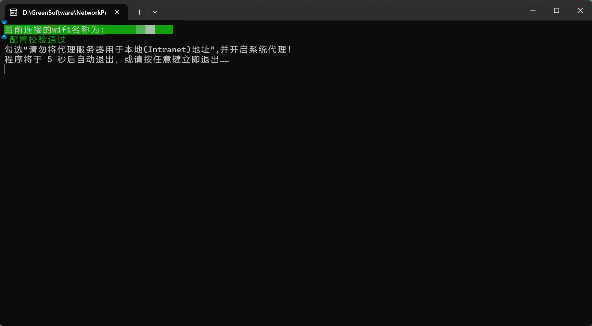

# NetworkProxy
Windows系统一键配置系统代理

# 一、打包成 exe 文件步骤

1. 通过 `PyCharm Professional` 打开本项目

2. 依次点击 `设置` -> `项目:项目名称 ` -> `Python解释器` -> `+`

3. 在弹出页面中搜索 `pyinstaller` ，并添加

4. 在`终端`执行打包指令

   ```cmd
   pyinstaller -F -i ./ico.ico ./main.py -n NetworkProxy.exe
   ```

   即可在本项目的 `dist` 目录下找到打包好的`exe`文件。

# 二、配置文件

位置：`main.py` 同目录下的 `proxy.json`

```
{
                "mode": "name",
                "localIdentification": "<local>;",
                "auto": {
                    "notLocal": "selected",
                    "ProxyServer": "",
                    "ProxyOverride": ""
                },
                "name": {
                    "wifiName1": {
                        "enable": "open",
                        "notLocal": "selected",
                        "ProxyServer": "",
                        "ProxyOverride": ""
                    },
                    "wifiName2": {
                        "enable": "close",
                        "notLocal": "selected",
                        "ProxyServer": "",
                        "ProxyOverride": ""
                    },
                    "wifiName3": {
                        "enable": "open",
                        "notLocal": "not selected",
                        "ProxyServer": "127.0.0.1:80",
                        "ProxyOverride": ""
                    }
                },
                "manual": {
                    "notLocal": "selected",
                    "ProxyServer": "",
                    "ProxyOverride": ""
                }
            }
```

模式解释

```
自动模式(auto)：识别代理状态并置反，开启系统代理时 配置参照 "auto" 属性。

识别wifi名称模式(name)：获取当前wifi名称，参照"name"对象内的wifi名称对应配置文件内容设置系统代理。

手动模式(manual)：读取配置文件 manual 属性内容，并根据手动选择选项，配置系统代理。
```


字段解释：

```
mode: 必填项, 值仅可填写其中一种。 [ "auto" , "name" , "manual" ]

enable: 必填项, 当值为"open"时，开启系统代理 ，填写其他值则关闭。

notLocal: 非必填项，当值为"selected"时，勾选 “请勿将代理服务器用于本地(Intranet)地址” 选项，其他值不勾选。

localIdentification: 必填项，勾选 “请勿将代理服务器用于本地(Intranet)地址” 选项 的标识字符串，默认为"<local>;"。

ProxyServer: 必填项，设置代理的地址，格式为 ip:port 。

ProxyServer: 非必填项，忽略的地址列表，字符串格式，地址见以分段号分割 ，若是包含字符串"<local>;" ，则勾选  “请勿将代理服务器用于本地(Intranet)地址” 选项。

name: 可填写多项，配置参考模板。
```

# 三、添加系统任务

3.1 新建系统任务



3.2 配置`常规`页面



3.3 配置`触发器`页面



3.4 配置`操作`页面



3.5 配置`条件`页面



3.5 配置`密码`页面



3.6 其他

```
1、如果将 常规 - 安全选项 设置为“在用户登录时运行（R)”，系统在连接wifi后会弹出一个cmd窗口。
2、如果将 常规 - 安全选项 设置为“管用户是否登录都要运行(W)”，系统在连接wifi后不会弹出cmd窗口。
```



